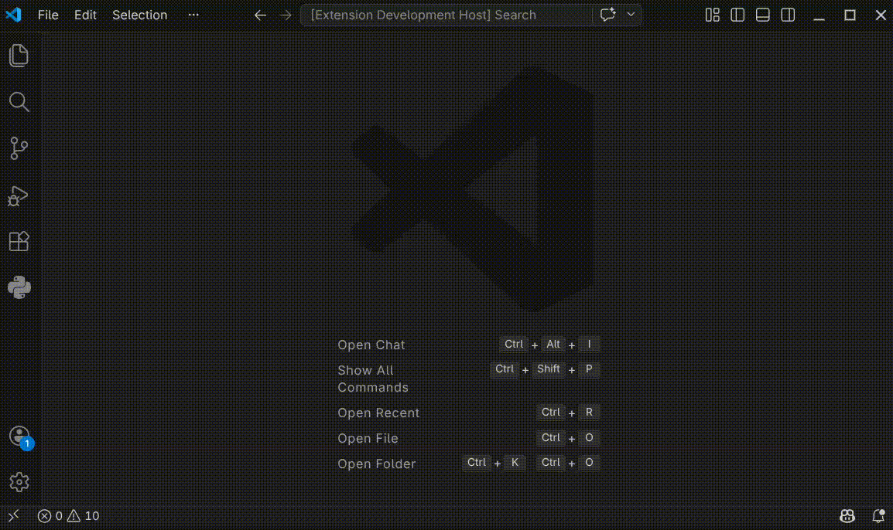
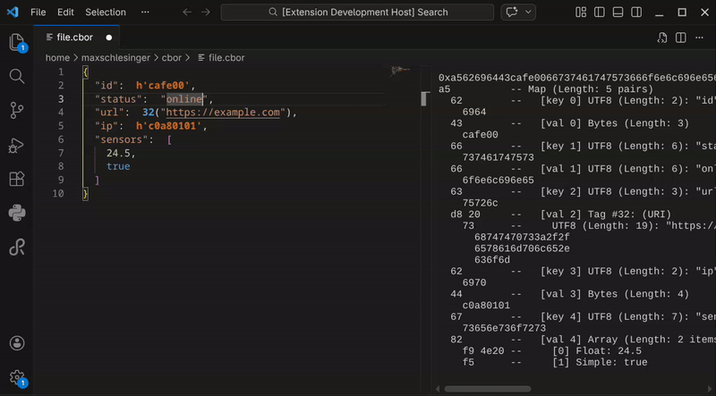
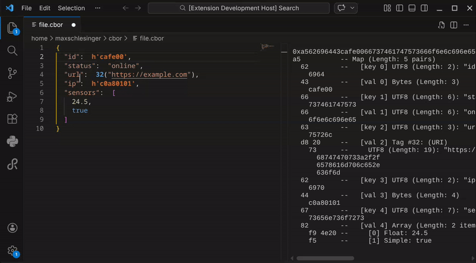
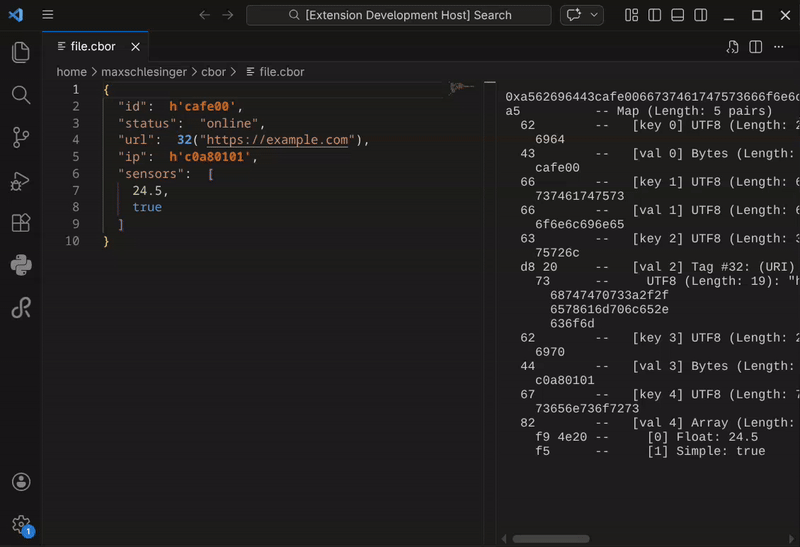
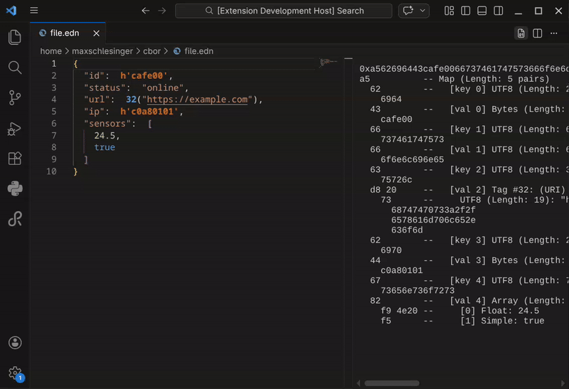

# CBOR EDN Editor (Preview 2)

> **NOTE: This is a Pre-Release.**
> Features may change, and bugs might occur.
> Please report any issues in the [Issues](https://github.com/max-schlesinger/cbor-edn-editor/issues) section.

**CBOR EDN Editor** allows you to open, view, and edit binary CBOR files as human-readable **Extended Diagnostic Notation (EDN)** directly in VS Code.

_Open `.cbor` files instantly in a split-view editor._

## Features

### Live Side-by-Side Hex Editing

Watch your binary data change as you type. The integrated view shows the exact Hex representation of your CBOR structure in real-time. No manual compilation needed.

### Live syntax error checking & Quick Fixes

Powered by a custom parser, the editor catches syntax errors instantly, underlines them in red, and offers Quick Fix suggestions when available.

### Export Options

- When a CBOR file is opened, it can be exported as EDN.
- When an EDN file is opened, it can be exported as CBOR.

  
  

## Known Issues / Limitations

- **Syntax Checking:** The validation is currently experimental. It may not catch all edge cases or complex nested structures yet.
- **Large Files:** Very large files might cause performance problems during live updates.
- **Comments in CBOR:** Since CBOR is a binary format, comments in `.cbor` files are discarded when saving. Comments in `.edn` files are preserved.

## Installation/Usage

1. Download the latest `.vsix` file from **[Releases](https://github.com/max-schlesinger/cbor-edn-editor/releases)**.
2. In VS Code, open the Extensions view and select **Install from VSIX...**.

3. Choose the downloaded file.
4. **Open a File:** Simply click on any `.cbor` or `.edn` file. It will open in the custom editor.

## Credits & License

This extension is based on the [vscode-scitt-preview](https://github.com/transmute-industries/vscode-scitt-preview) repository by Transmute Industries.

Licensed under the MIT License.
